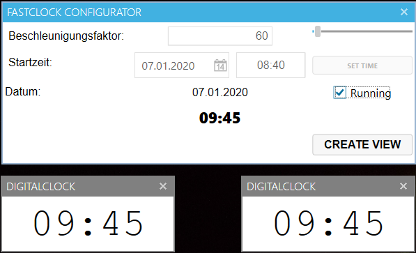
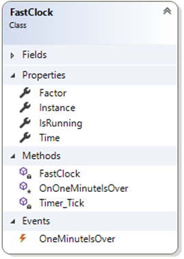

# FastClock mit Events

# Lernziele

* Events

# Beschreibung

## Allgemein

Es ist eine schnell laufende Uhr (`FastClock`) zu realisieren, die von beliebig vielen Anzeigen (DigitalClock) "beobachtet" wird:

`FastClock` ist dabei in der Logikschicht derart zu verwalten, dass sowohl der Faktor, um den die Uhr schneller läuft, als auch Startdatum und Startzeit einstellbar sind. Über das Event `OneMinuteIsOver` werden alle angemeldeten Views (`Observer`) verständigt, sobald sich die Minute verändert hat. Die Uhr kann bei Bedarf auch angehalten werden (Property `IsRunning` in Klasse `FastClock`, bzw Checkbox Running in GUI zum Setzen der Property).

## Anforderungen

* Realisierung als Zweischichtanwendung mit GUI und Logik.
* Für den Timer im Logikprojekt die Klasse `DispatcherTimer` verwenden.
* Das Timerintervall ist so einzustellen, dass es auslöst, wenn für die `FastClock` eine Minute vergangen ist (dann kann in der `FastClock` einfach eine Minute dazugezählt werden)
    * Das kürzeste Intervall ist 1 (1ms == 1Minute), das längste Intervall lässt die Uhr in Normalgeschwindigkeit laufen (Faktor = 1)
* Die `FastClock` ist als `Singleton` zu implementieren, damit alle Beobachter die selbe Uhrzeit haben

## Eventhandler

Als Basis für den Event soll ein generischer `EventHandler<DateTime>` verwendet werden.

## Spezialistenaufgabe
* Spezialisten erzeugen eine Analoguhr als alternativen Observer.

